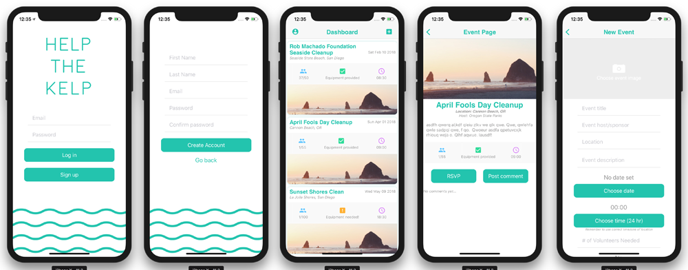

# Help the Kelp
70% of the oxygen in the atmosphere is produced by marine plants.

26 million tons of plastic ends up in our oceans each year.

A plastic bottle takes at least 450 years to degrade.

These facts are incompatible.

## TODO
### General
- [ ] Firebase image storage

### Known issues
- [ ] Date does not stay in top left of event card on dashboard if long title
- [ ] RSVP count does not update live on event page, but does database side

### Login & SignUp
- [x] Firebase login & signup

### Dashboard
- [x] Dashboard page with event cards
- [ ] Sort events by date
- [ ] Notify users when new event added near them
- [ ] Notify users when cleanup starts soon

### Profile
- [x] Profile page with user stats
- [x] Logout
- [ ] Edit profile info
- [ ] Update stats
- [ ] CameraRoll access for profile pictures
- [ ] Settings page
- [ ] History of cleanups attended

### AddEvent
- [x] AddEvent page
- [ ] Implement maps/markers for choosing location on AddEvent page
- [ ] CameraRoll access for event images

### ViewEvent
- [x] ViewEvent page with more info about a cleanup
- [x] Add commenting on ViewEvent page
- [ ] RSVP functionality on ViewEvent page
- [ ] Report rude comments
- [ ] Edit event if owner

And always, thank you to Stack Overflow.

This project was bootstrapped with [Create React Native App](https://github.com/react-community/create-react-native-app).
